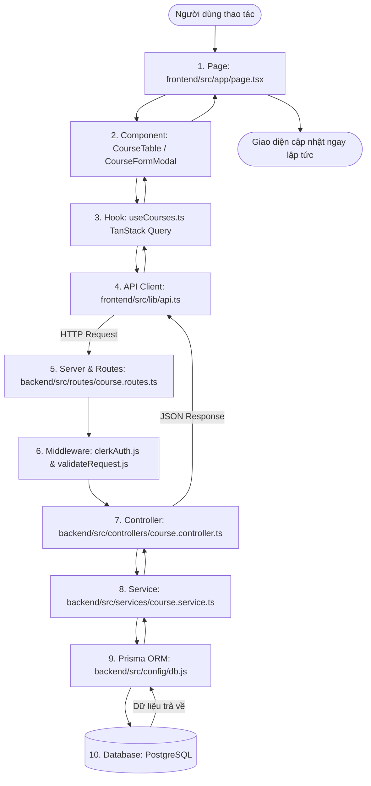

# 📘 TÀI LIỆU HỆ THỐNG KIẾN TRÚC PROJECT: EDUHUB PRO

> **Dành cho:** Người mới học lập trình (Junior / Beginner)  
> **Mục tiêu:** Hiểu rõ toàn bộ dự án từ giao diện, luồng dữ liệu, cấu trúc thư mục đến cơ sở dữ liệu mà không bị ngợp bởi code.

---

## 📌 MỤC LỤC
1. [Phần 1: Dự án này là gì?](#phần-1-dự-án-này-là-gì)
2. [Phần 2: Bức tranh tổng thể & Luồng đi của dữ liệu](#phần-2-bức-tranh-tổng-thể--luồng-đi-của-dữ-liệu)
3. [Phần 3: Cấu trúc thư mục thực tế & Nhiệm vụ từng folder](#phần-3-cấu-trúc-thư-mục-thực-tế--nhiệm-vụ-từng-folder)
4. [Phần 4: Bản đồ 7 chức năng chính trong hệ thống](#phần-4-bản-đồ-7-chức-năng-chính-trong-hệ-thống)
5. [Phần 5: 5 câu hỏi tự kiểm tra độ hiểu bài](#phần-5-5-câu-hỏi-tự-kiểm-tra-độ-hiểu-bài)

---

# PHẦN 1: DỰ ÁN NÀY LÀ GÌ?

### 1. Tên và Mục đích
* **Tên ứng dụng:** **EduHub Pro - Course Management System** (Hệ thống Quản lý Khóa học Trực tuyến).
* **Mục đích:** Đây là trang Dashboard/Admin giúp quản trị viên hoặc giảng viên quản lý danh mục khóa học: tạo mới, cập nhật giá tiền, xuất bản khóa học, quản lý mục tiêu học tập và theo dõi số lượng học viên đăng ký.

### 2. Người dùng có thể làm những gì?
* **Xem & Lọc:** Xem danh sách khóa học dạng Bảng (Table) hoặc Thẻ (Grid); tìm kiếm theo tên; lọc theo Danh mục, Cấp độ, Trạng thái.
* **Xem thống kê:** Xem số lượng khóa học, học viên, đánh giá trung bình.
* **Xem chi tiết:** Bấm xem Drawer trượt ra chứa toàn bộ giáo trình, yêu cầu và thẻ tag.
* **Đăng nhập Google:** Đăng nhập an toàn qua dịch vụ Clerk.
* **Quản trị (Yêu cầu đăng nhập):** Tạo khóa học mới, chỉnh sửa thông tin, hoặc xóa khóa học.

### 3. Frontend làm nhiệm vụ gì?
* **Thư mục:** `/Users/admin/Desktop/Frontend-Course/frontend`
* **Công nghệ:** Next.js 14 (App Router), React 18, Ant Design 5, Tailwind CSS, TanStack Query v5.
* **Nhiệm vụ:**
  * Vẽ giao diện hiển thị cho người dùng trên trình duyệt.
  * Bắt các sự kiện click, gõ chữ.
  * Kiểm tra lỗi form (Zod validation) trước khi gửi đi.
  * Gửi yêu cầu qua mạng (HTTP Request) sang Backend bằng Axios.

### 4. Backend làm nhiệm vụ gì?
* **Thư mục:** `/Users/admin/Desktop/Frontend-Course/backend`
* **Công nghệ:** Node.js, Express, TypeScript, Prisma ORM, Clerk Express SDK.
* **Nhiệm vụ:**
  * Đóng vai trò máy chủ tiếp nhận yêu cầu từ Frontend.
  * Soát vé bảo mật: kiểm tra Token của người dùng (chỉ người đã đăng nhập mới được tạo/sửa/xóa).
  * Xử lý nghiệp vụ logic: tự động tạo đường dẫn `slug`, tính toán trang (pagination).
  * Trực tiếp ra lệnh cho PostgreSQL (thông qua Prisma ORM) để thêm, sửa, xóa dữ liệu.

### 5. Dữ liệu chính của hệ thống là gì?
* Định nghĩa tại: `/Users/admin/Desktop/Frontend-Course/backend/prisma/schema.prisma`
* Thực thể lưu trong Database là bảng **`Course`** gồm các trường:
  * `id`: Khóa chính định danh duy nhất (UUID).
  * `title`, `slug`: Tên khóa học và đường dẫn URL thân thiện.
  * `description`: Mô tả khóa học.
  * `instructor`, `instructorEmail`: Thông tin giảng viên.
  * `category`: Phân loại (Frontend, Backend, AI & ML, Fullstack...).
  * `level`: Cấp độ (`BEGINNER`, `INTERMEDIATE`, `ADVANCED`, `ALL_LEVELS`).
  * `status`: Trạng thái (`DRAFT`, `PUBLISHED`, `ARCHIVED`).
  * `price`, `discountPrice`, `durationHours`: Học phí và thời lượng.
  * `tags`, `requirements`, `objectives`: Danh sách kỹ năng và điều kiện học.
* *Lưu ý về User:* Thông tin tài khoản người dùng được lưu trữ và bảo mật trên Cloud của **Clerk**, Backend chỉ xác thực vé đăng nhập (JWT token) chứ không lưu mật khẩu.

---

# PHẦN 2: BỨC TRANH TỔNG THỂ & LUỒNG ĐI CỦA DỮ LIỆU

Khi người dùng thao tác trên trình duyệt, dữ liệu chạy qua hệ thống theo đúng quy trình tuần tự sau:



### Nguyên Tắc Cốt Lõi:
1. **Frontend không bao giờ kết nối thẳng vào Database:** Nếu làm vậy sẽ lộ toàn bộ mật khẩu cơ sở dữ liệu cho người dùng.
2. **Backend là cổng gác an toàn:** Chỉ Backend mới có chìa khóa nói chuyện với PostgreSQL qua Prisma. Mọi yêu cầu từ Frontend đều phải gửi qua đường truyền HTTP.

---

# PHẦN 3: CẤU TRÚC THƯ MỤC THỰC TẾ & NHIỆM VỤ TỪNG FOLDER

```text
Frontend-Course/
├── docker-compose.yml                      # Khởi chạy PostgreSQL trên Docker
├── package.json                            # Điều khiển chạy cả frontend & backend
│
├── backend/                                # ⚙️ KHU VỰC BACKEND (Node.js + Express)
│   ├── prisma/
│   │   ├── schema.prisma                   # Khai báo cấu trúc bảng cơ sở dữ liệu
│   │   └── seed.ts                         # Dữ liệu mẫu ban đầu
│   └── src/
│       ├── config/                         # Cấu hình db.ts (Prisma) và env.ts (.env)
│       ├── controllers/                    # Tiếp nhận Request, gọi Service, trả Response
│       ├── middlewares/                    # Kiểm tra quyền đăng nhập và kiểm tra dữ liệu đầu vào
│       ├── routes/                         # Định nghĩa các đường dẫn URL API (/api/courses)
│       ├── services/                       # Nơi viết các hàm truy vấn DB và logic nghiệp vụ
│       ├── validators/                     # Luật kiểm tra dữ liệu bằng Zod
│       └── server.ts                       # Điểm khởi chạy server Express
│
└── frontend/                               # 🎨 KHU VỰC FRONTEND (Next.js 14)
    └── src/
        ├── app/                            # Các trang màn hình theo đường dẫn URL (Routing)
        ├── components/                     # Các khối giao diện tái sử dụng
        │   ├── auth/                       # Nút đăng nhập Google, modal kiểm tra token
        │   ├── courses/                    # Bảng, Card, Form Modal, Filter bar, Drawer
        │   ├── CourseFormModal/            # Thư mục tách nhỏ form (đang thử nghiệm)
        │   └── layout/                     # Thanh Header (Navbar) và Chân trang (Footer)
        ├── hooks/                          # Custom Hooks gọi API và quản lý cache (TanStack Query)
        ├── lib/                            # Cấu hình gọi mạng Axios và cấu hình Ant Design
        ├── providers/                      # Bộ bọc Provider (Theme, Auth, Query)
        ├── types/                          # Định nghĩa kiểu dữ liệu TypeScript
        └── validations/                    # Luật kiểm tra form phía frontend (Zod)
```

---

### Chi Tiết Từng Folder Quan Trọng:

#### 1. `frontend/src/app`
* **Dùng để:** Định nghĩa các trang của ứng dụng (App Router của Next.js).
* **Ví dụ file:** 
  * `page.tsx`: Trang chủ chứa Dashboard.
  * `layout.tsx`: Khung viền bọc ngoài chung cho toàn bộ website (Header, Providers...).
  * `sign-in/[[...sign-in]]/page.tsx`: Trang đăng nhập.
* **Khi nào vào đây:** Khi bạn muốn thêm trang mới (ví dụ `/profile`), chỉnh sửa giao diện tổng thể của trang chủ hoặc bố cục chung.

#### 2. `frontend/src/components`
* **Dùng để:** Chứa các khối giao diện (Component) để lắp ghép vào các trang.
* **Ví dụ file:** `Navbar.tsx`, `CourseTable.tsx`, `CourseGrid.tsx`.
* **Khi nào vào đây:** Khi bạn muốn sửa nút bấm, chỉnh cách hiển thị của bảng, đổi màu sắc card khóa học.

#### 3. Phân biệt: `components/courses` vs `components/CourseFormModal`
* **`frontend/src/components/courses/`**: Chứa các component giao diện khóa học như `CourseTable.tsx`, `CourseGrid.tsx`, `CourseFilterBar.tsx`, `CourseDetailDrawer.tsx`...
* **`frontend/src/components/CourseFormModal/`**: **Đã hoàn thành refactor thành công!** Đây là thư mục component chính đang chạy form tạo/sửa khóa học trên toàn bộ ứng dụng, được module hóa sạch đẹp với `index.tsx` và 7 component con. File cũ `components/courses/CourseFormModal.tsx` đã được dọn dẹp sạch sẽ.

#### 4. `backend/src/routes` vs `backend/src/controllers` vs `backend/src/services`
* **`routes/`**: Nơi gắn nhãn đường dẫn URL (Ví dụ: `GET /courses` thì giao cho ai làm).
* **`controllers/`**: Người lễ tân tiếp nhận yêu cầu từ client, bóc tách dữ liệu gửi lên và chuyển tiếp cho tầng Service, sau đó đóng gói JSON trả về.
* **`services/`**: Người đầu bếp trực tiếp nấu món ăn: xử lý logic, tính toán, và gọi `prisma.course...` để thao tác trực tiếp với cơ sở dữ liệu.

---

# PHẦN 4: BẢN ĐỒ 7 CHỨC NĂNG CHÍNH TRONG HỆ THỐNG

| STT | Tên chức năng | Người dùng làm gì | File Page & Component | Backend Route & Controller | Dữ liệu liên quan |
|---|---|---|---|---|---|
| **1** | **Xem danh sách & Lọc khóa học** | Gõ tìm kiếm, chọn lọc danh mục/level, chuyển đổi Table/Grid view | `src/app/page.tsx`<br>• `CourseFilterBar.tsx`<br>• `CourseTable.tsx`<br>• `CourseGrid.tsx` | `GET /api/courses`<br>• `course.routes.ts`<br>• `CourseController.getCourses`<br>• `CourseService.getCourses` | Bảng `Course` (hỗ trợ phân trang, sắp xếp) |
| **2** | **Xem số liệu thống kê (Stats)** | Xem 4 thẻ đếm số khóa học, học viên, rating ở đầu trang | `src/app/page.tsx`<br>• `CourseStatsOverview.tsx` | `GET /api/courses/stats/summary`<br>• `CourseController.getStats`<br>• `CourseService.getStats` | Hàm tính toán tổng hợp (`count`, `avg`) từ bảng `Course` |
| **3** | **Xem chi tiết khóa học (Detail)** | Bấm nút con mắt, xem thanh trượt Drawer bên phải | `src/app/page.tsx`<br>• `CourseDetailDrawer.tsx` | `GET /api/courses/:id`<br>• `CourseController.getCourseById` | Bản ghi cụ thể của bảng `Course` |
| **4** | **Đăng nhập Google qua Clerk** | Bấm đăng nhập, nhận diện phiên làm việc và hiển thị avatar | `src/components/layout/Navbar.tsx`<br>• `GoogleLoginButton.tsx`<br>• `AuthInspectorModal.tsx` | `GET /api/auth/me`<br>• `auth.routes.ts`<br>• `authController.getMe` | Clerk Session Token & JWT |
| **5** | **Tạo khóa học mới (Create)** *(Cần login)* | Bấm "+ Add New Course", điền form và ấn Submit | `src/app/page.tsx`<br>• `components/CourseFormModal/index.tsx`<br>• `AuthRequiredModal.tsx` | `POST /api/courses`<br>• `requireAuth`<br>• `CourseController.createCourse`<br>• `CourseService.createCourse` | Dữ liệu khóa học mới, tự sinh `slug` duy nhất |
| **6** | **Chỉnh sửa khóa học (Edit)** *(Cần login)* | Bấm nút cây bút, sửa thông tin trên form và lưu | `src/app/page.tsx`<br>• `components/CourseFormModal/index.tsx` | `PUT /api/courses/:id`<br>• `requireAuth`<br>• `CourseController.updateCourse`<br>• `CourseService.updateCourse` | Cập nhật bản ghi theo `id` |
| **7** | **Xóa khóa học (Delete)** *(Cần login)* | Bấm nút thùng rác, xác nhận hộp thoại để xóa | `src/app/page.tsx`<br>• `DeleteCourseModal.tsx` | `DELETE /api/courses/:id`<br>• `requireAuth`<br>• `CourseController.deleteCourse`<br>• `CourseService.deleteCourse` | Xóa bản ghi trong PostgreSQL |

---

# PHẦN 5: 5 CÂU HỎI TỰ KIỂM TRA ĐỘ HIỂU BÀI

Để chắc chắn bạn đã nắm vững nền tảng kiến trúc trước khi chúng ta chuyển sang mổ xẻ chi tiết Form ở Phần 5, hãy thử trả lời 5 câu hỏi ngắn sau:

1. **Khi người dùng mở trang chủ xem danh sách khóa học, Frontend (Next.js) có kết nối trực tiếp vào PostgreSQL không? Vì sao?**
2. **File `CourseFormModal` đang thực sự hiển thị trên giao diện của bạn nằm ở thư mục nào: `components/courses/CourseFormModal.tsx` hay `components/CourseFormModal/index.tsx`?**
3. **Trong file cơ sở dữ liệu `schema.prisma`, hiện tại có bảng lưu thông tin người dùng (`User`) không? Dịch vụ nào đang quản lý người dùng đăng nhập?**
4. **Nếu bạn muốn sửa câu lệnh lấy dữ liệu từ cơ sở dữ liệu (ví dụ thay đổi cách lọc giá tiền hoặc sắp xếp), bạn sẽ vào file nào trong Backend: `course.routes.ts`, `course.controller.ts`, hay `course.service.ts`?**
5. **Nếu người dùng chưa đăng nhập tài khoản Google mà bấm nút "+ Add New Course", giao diện sẽ hiển thị điều gì?**

---
*File này đã được lưu tại thư mục gốc của dự án: `HE_THONG_PROJECT.md` để bạn có thể mở đọc lại bất cứ lúc nào.*
